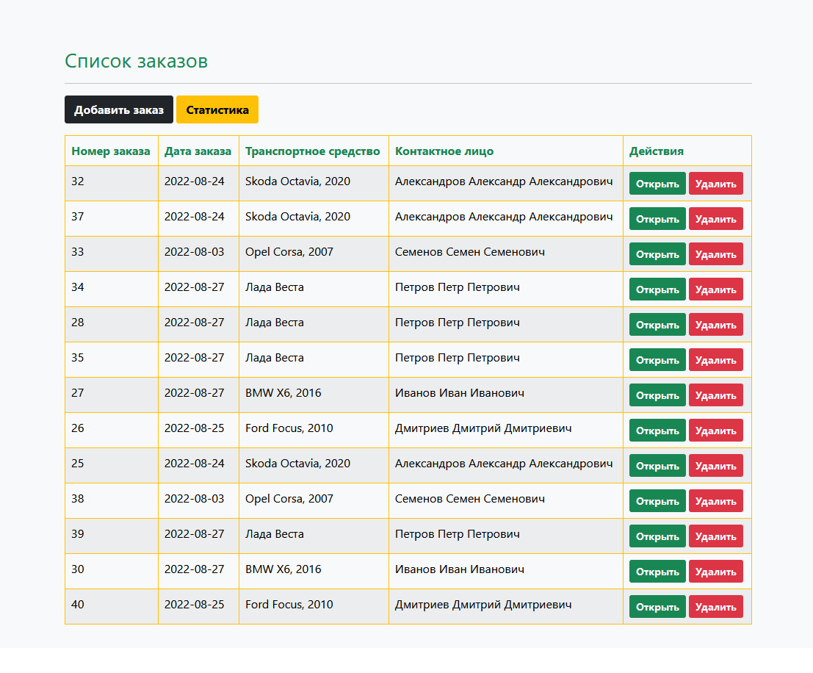
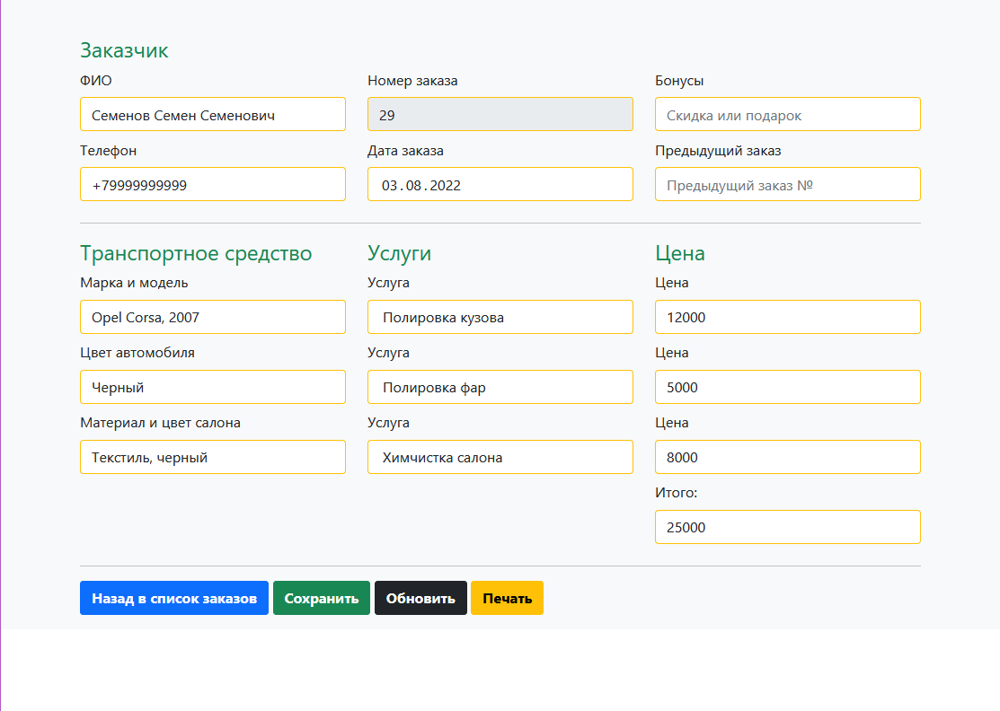
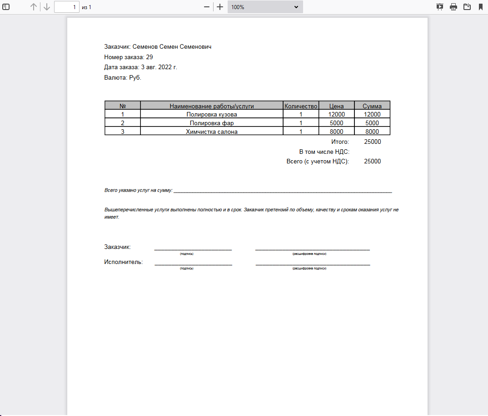

# Detailing studio web application
          
Detailing studio App - web application for monitoring orders in detailing or auto repair shop.

The application allows you to keep track of orders. The interface is simple and straightforward. It is possible to create order, update information, delete useless data, display data by categories, control orders, copy and export data, monthly and daily total sum.

The application is suitable for small and medium detailing studious and auto repair shops. Efforts are under way in scaling web application for big business.

